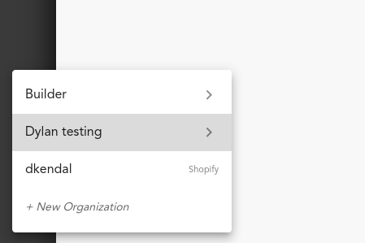
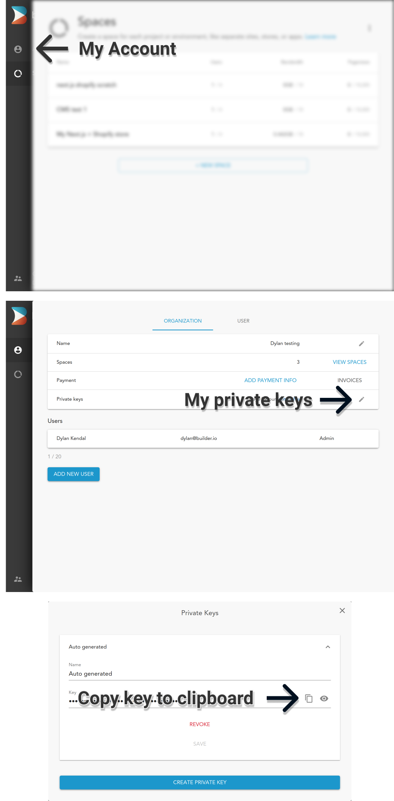

# Next.js + Shopify + Builder.io starter kit

The ultimate starter for headless Shopify stores. 

Demo live at: [headless.builders](https://headless.builders/)

## Goals and Features

- Ultra high performance
- SEO optimized
- Themable
- Personalizable (internationalization, a/b testing, etc)
- Builder.io Visual CMS integrated
- Connect to Shopify data through Builder's high speed data layer

## Video walkthrough

Learn how to get started with this Builder + Next.js + Shopify starter with this step by step video guide here:

<a href="https://www.youtube.com/watch?v=uIHqPu2t1O0">
    
</a>

## Table of contents

  - [Getting Started](#getting-started)
      - [1: Create an account for Builder.io](#1-create-an-account-for-builderio)
      - [2: Your Builder.io private key](#2-your-builderio-private-key)
      - [3: Clone this repository and initialize a Builder.io space](#3-clone-this-repository-and-initialize-a-builderio-space)
      - [4. Shopify private app](#4-shopify-private-app)
      - [5. Connecting Builder to Shopify](#5-connecting-builder-to-shopify)
      - [6. Configure the project to talk to Shopify](#6-configure-the-project-to-talk-to-shopify)
      - [7. Up and Running!](#7-up-and-running)
  - [Deploy](#deploy)

<!-- markdown-toc end -->


## Getting Started

**Pre-requisites**

This guide will assume that you have the following software installed:

- nodejs (>=12.0.0)
- npm
- git

You should already have a [Shopify](https://www.shopify.com/online-store) account and store created before starting as well. 

**Introduction**

This starter kit is everything you need to get your own self hosted
Next.js project powered by Builder.io for content and Shopify as an
e-commerce back office.

After following this guide you will have

- A Next.js app, ready to deploy to a hosting provider of your choice
- Pulling live collection and product information from Shopify
- Powered by the Builder.io visual CMS

### 1: Create an account for Builder.io

Before we start, head over to Builder.io and [create an account](https://builder.io/signup).

### 2: Your Builder.io private key

Head over to your [organization settings page](https://builder.io/account/organization?root=true) and create a
private key, copy the key for the next step.

- Visit the [organization settings page](https://builder.io/account/organization?root=true), or select
  an organization from the list 



- Click "Account" from the left hand sidebar
- Click the edit icon for the "Private keys" row
- Copy the value of the auto-generated key, or create a new one with a name that's meaningful to you




### 3: Clone this repository and initialize a Builder.io space

Next, we'll create a copy of the starter project, and create a new
[space](https://www.builder.io/c/docs/spaces) for it's content to live
in.

In the example below, replace `<private-key>` with the key you copied
in the previous step, and change `<space-name>` to something that's
meaningful to you -- don't worry, you can change it later!

```
git clone https://github.com/BuilderIO/nextjs-shopify.git
cd nextjs-shopify

npm install --global "@builder.io/cli"

builder create --key "<private-key>" --name "<space-name>" --debug
```

Note:
if you're only interested in using this starter for a landing page with Shopify use this command instead:

```
builder create --key "<private-key>" --name "<space-name>" --input builder-landing-page-only --debug
```


If this was a success you should be greeted with a message that
includes a public API key for your newly minted Builder.io space.

*Note: This command will also publish some starter builder.io cms
content from the ./builder directory to your new space when it's
created.*

``` bash
  ____            _   _       _                     _                    _   _ 
| __ )   _   _  (_) | |   __| |   ___   _ __      (_)   ___       ___  | | (_)
|  _ \  | | | | | | | |  / _` |  / _ \ | '__|     | |  / _ \     / __| | | | |
| |_) | | |_| | | | | | | (_| | |  __/ | |     _  | | | (_) |   | (__  | | | |
|____/   \__,_| |_| |_|  \__,_|  \___| |_|    (_) |_|  \___/     \___| |_| |_|

|████████████████████████████████████████| shopify-product | 0/0
|████████████████████████████████████████| product-page: writing generic-template.json | 1/1
|████████████████████████████████████████| shopify-collection | 0/0
|████████████████████████████████████████| collection-page: writing generic-collection.json | 1/1
|████████████████████████████████████████| page: writing homepage.json | 2/2


Your new space "next.js shopify starter" public API Key: 012345abcdef0123456789abcdef0123
```

Copy the public API key ("012345abcdef0123456789abcdef0123" in the example above) for the next step.

This starter project uses dotenv files to configure environment variables.
Open the files [.env.development](./.env.development) and
[.env.production](./.env.production) in your favorite text editor, and
set the value of `BUILDER_PUBLIC_KEY` to the public key you just copied.
You can ignore the other variables for now, we'll set them later.

```diff
+ BUILDER_PUBLIC_KEY=012345abcdef0123456789abcdef0123
- BUILDER_PUBLIC_KEY=
SHOPIFY_STOREFRONT_API_TOKEN=
SHOPIFY_STORE_DOMAIN=
```

### 4. Shopify Custom App 

Create a [custom app](https://help.shopify.com/en/manual/apps/custom-apps) for your Shopify store. If you don't have a Shopify store already, you can create a [development store](https://help.shopify.com/en/partners/dashboard/managing-stores/development-stores).

When creating the private app you'll have to set a number of permissions so that builder can retrieve your Shopify inventory. For this press on `Storefront API` in the configuration tab and choose all the following permissions:


Then in the `API Credentials` tab, click `install`:


And copy the generated access token.


### 5. Connecting Builder to Shopify

Access your newly created space by selecting it from the [list of spaces](https://builder.io/spaces?root=true)
in your organization.

You should be greeted by a modal asking for various your storefront Access toke (from preview step) and your store domain, this will allow Builder.io to communicate with your store API:


Fill in the required keys and press "Connect your Shopify Custom App"!

### 6. Configure the project to talk to Shopify

Open up [.env.development](./.env.development) and [.env.production](./.env.production) again,
but this time set the other two Shopify keys.

```diff
BUILDER_PUBLIC_KEY=012345abcdef0123456789abcdef0123
+ SHOPIFY_STOREFRONT_API_TOKEN=c11b4053408085753bd76a45806f80dd
- SHOPIFY_STOREFRONT_API_TOKEN=
+ SHOPIFY_STORE_DOMAIN=dylanbuilder.myshopify.com
- SHOPIFY_STORE_DOMAIN=
```

### 7. Up and Running!

The hard part is over, all you have to do is start up the project now.

```bash
npm install
npm run dev
```

This will start a server at `http://localhost:3000`.

Go to your [new space settings](https://builder.io/account/space) and change the site url to your localhost `http://localhost:3000` for site editing.

<!-- This guide needs a lot more work here, clarifying how to get some basic stuff -->
<!-- working with in builder, building out product grids etc - the ./builder content -->
<!-- that's intially published is hard coded to the collections on the demo store -->
<!-- and won' work out of the box. -->

### 8. Start building
Now that we have everything setup, start building and publishing pages on builder.io, for a demo on building something similar to the [demo homepage](https://headless.builders), follow the steps in this [short video](https://www.loom.com/share/9b947acbbf714ee3ac6c319c130cdb85)

## Deployment Options

You can deploy this code anywhere you like - you can find many deployment options for Next.js [here](https://nextjs.org/docs/deployment). The following options support one click installs and are super easy to start with:

[](https://vercel.com/new/git/external?repository-url=https%3A%2F%2Fgithub.com%2Fbuilderio%2Fnextjs-shopify)

  - Vercel: for more information check [Vercel docs on Next.js deployments](https://vercel.com/docs/next.js/overview) Or try the one click install by clicking the button above.

[](https://app.netlify.com/start/deploy?repository=https://github.com/BuilderIO/nextjs-shopify)

- Netlify: For more information check [Netlify docs on Next.js deployments](https://www.netlify.com/blog/2020/11/30/how-to-deploy-next.js-sites-to-netlify/) Or try the one click install by clicking the button above.

