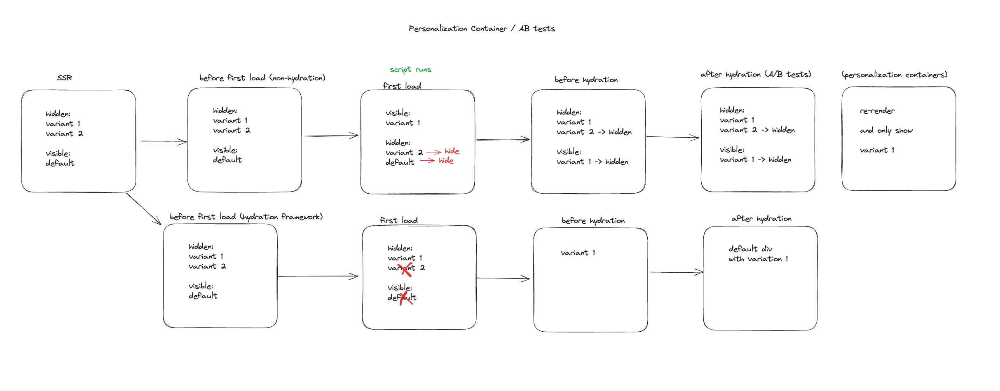

# Builder.io Personalization Container

This document explains how the Builder.io Personalization Container works across different SDKs and frameworks.

## Overview

The Personalization Container is a core component of Builder's SDK that enables targeting and scheduling capabilities on a block level. It handles rendering different variants based on user attributes cookie. Read more about them [here](https://www.builder.io/c/docs/variant-containers).

## How It Works

The Personalization Container renders content differently depending on:

1. The current environment (server-side or client-side)
2. The framework/SDK being used
3. User attributes and targeting criteria
4. Whether the content is being edited or previewed

### Core Functionality

The Personalization Container:

- Renders all variants during server-side rendering (SSR) but displays only the default variant initially. This is helpful for SEO and gives us the ability to detach/hide variants on the client side and avoid re-computation.
- Evaluates targeting rules against user attributes to determine the winning variant
- Updates the DOM to display the winning variant as quickly as possible
- Dispatches events when variants are loaded and displayed
- Handles different frameworks' hydration requirements

## SDK-Specific Behavior

The Personalization Container behaves differently depending on the SDK:

### React

React has a heavy hydration process, so the approach focuses on minimizing hydration costs:

- During SSR, all variants are rendered, but only the default is visible
- Before hydration, inlined scripts determine the winning variant
- Non-winning variants are completely removed from the DOM
- After hydration, only the winning variant remains

### Vue & Svelte

These frameworks require a "reset approach":

- During SSR, all variants are rendered with non-default variants hidden
- Inlined scripts update visibility attributes to show the correct variant
- After hydration, the component unmounts and re-renders with only the winning variant
- This two-step approach prevents hydration mismatches and allows us to show the dynamic `<Blocks />` that reacts to user attribute cookie updates and shows the winning variant.

## Technical Implementation

### Variant Selection

Variant selection follows these steps:

1. Check if editing/previewing a specific variant (in Builder's editor)
2. When in browser, evaluate targeting rules against user attributes cookie
3. Return the first matching variant or fall back to the default content

### Script Injection

The component injects two scripts during SSR:

- `updateVisibilityStylesScript`: Updates CSS to control variant visibility
- `personalizationScript`: Handles cookie management and DOM modifications

### Variant Reset

For SDKs requiring the reset approach (Vue, Svelte):

1. First render shows the winning variant and hides the non-winning variants
2. After hydration, component state is updated to trigger re-render with only the winning variant

## Events

The Personalization Container dispatches two custom events:

- `builder.variantLoaded`: When a variant is determined and loaded
- `builder.variantDisplayed`: When a variant becomes visible in the viewport

## Usage Considerations

- Personalization only works when user tracking is enabled
- Variants require proper targeting rules to be effective
- The container handles localization through the builder context

## Gen 2 SDK Framework Support Status

- ✅ React SDK - Full support with optimized hydration
- ✅ Vue SDK - Supported with reset approach
- ✅ Svelte SDK - Supported with reset approach
- ✅ Qwik SDK - Supported with reset approach
- ❌ Angular SDK - Not supported yet
- ❌ Solid SDK - Not supported yet
- ❌ Nextjs SDK - Not supported yet
- ❌ React Native SDK - Not supported

## Related Documentation

For more detailed information on how SSR A/B testing works, refer to the [SSR A/B Testing documentation](./SSR_AB_TEST.md).
