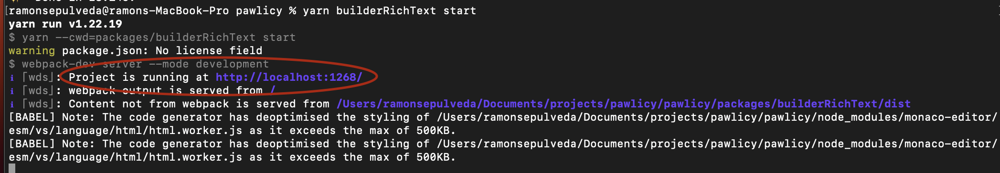
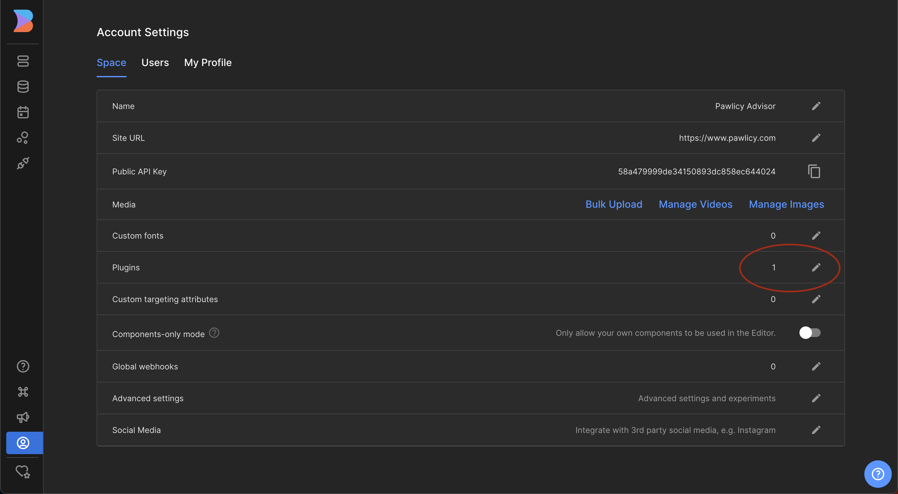
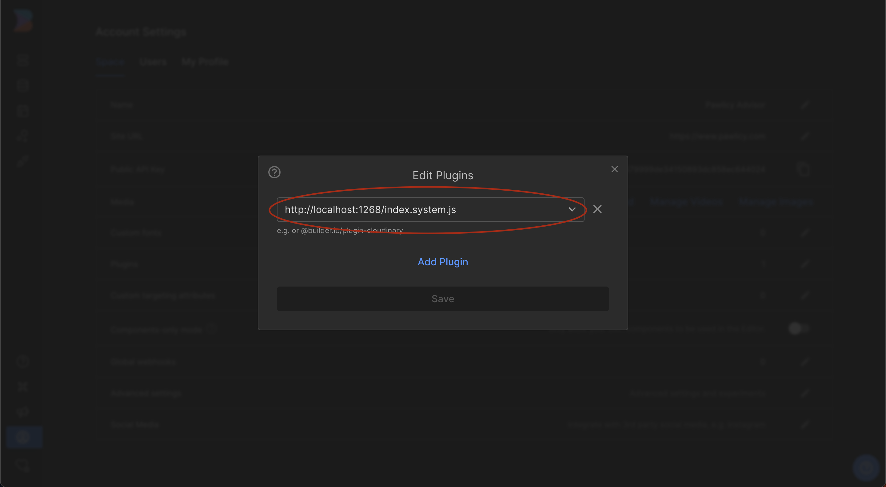
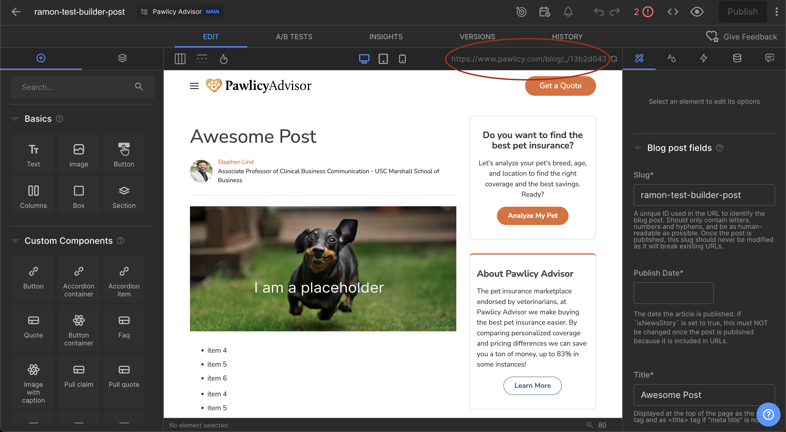
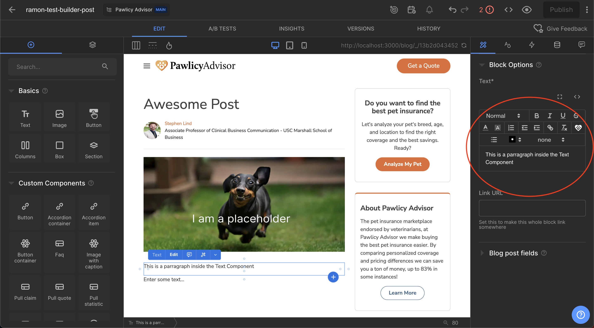

## Steps to use the editor inside builder io

### Development

- yarn install
- yarn builderRichText start
- Copy webpack hotreload URL

  

- Add plugin in builder io with the webpack URL and add "/index.system.js" at the end of the URL

  

  

- Open a blogpost and change the preview URL to the same url using localhost as a domain

  

- Use a component that uses the rich text editor

  

## Steps to use the editor inside builder io

- yarn install
- yarn builderRichText start:standalone
- open url in browser
